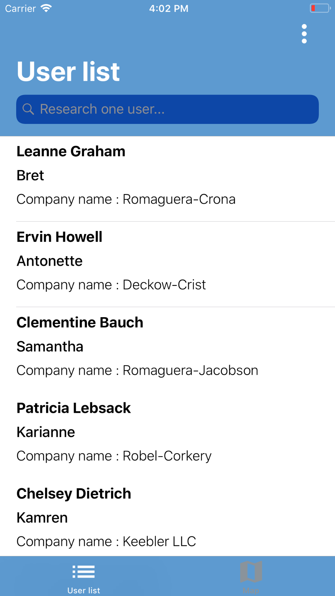
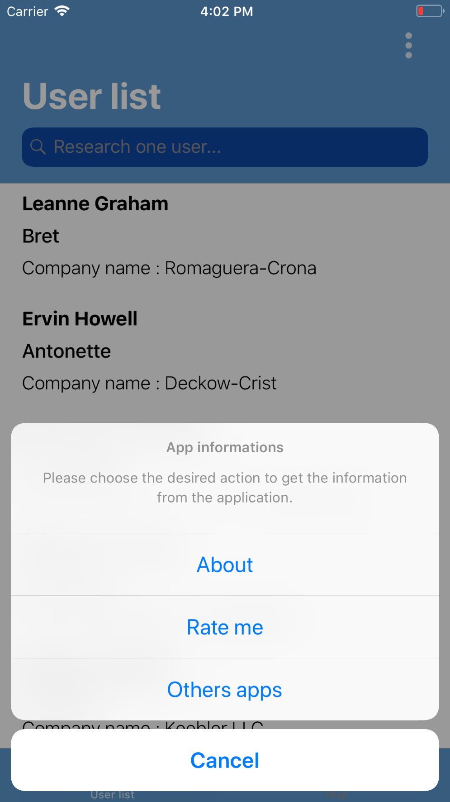
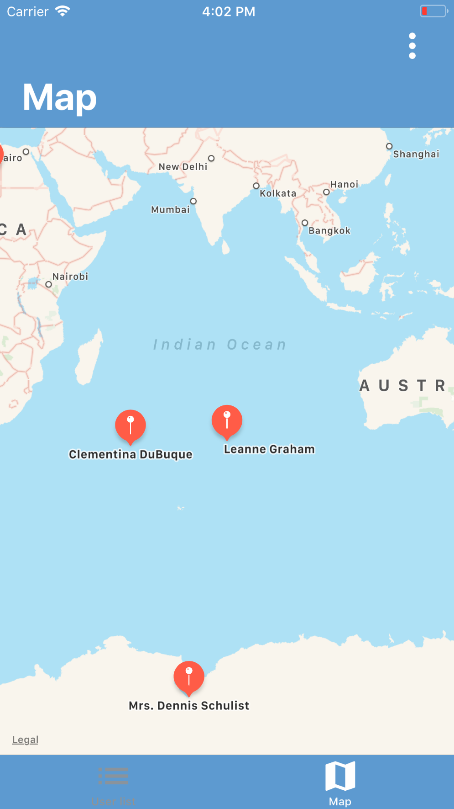
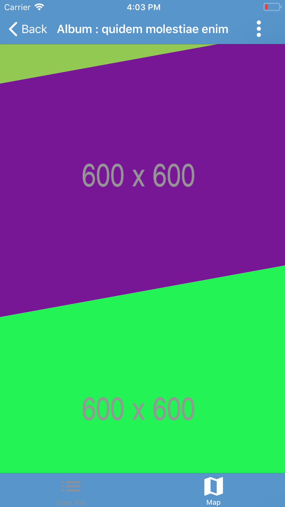

# PlaceholderApp iOS
> Prototype application made during my iOS exam (computer developer license). Realized on June 8, 2018 in 6h.

[![Swift Version][swift-image-4]][swift-url]
[![License][license-image]][license-url]


This application was developed as part of my iOS exam during one of my trainings.

It allows to visualize the possibilities of the iOS SDK by using the native components.

This application uses network communications to display the data. The latter are examples for good prototyping the application.

It only remains to modify the different layers (network / models) to display your own data !

     


## Features

- [x] Using a placeholder JSON API : http://jsonplaceholder.typicode.com/
- [x] TableView with searchController
- [x] MapKitView with annotation
- [x] CollectionView
- [x] CollectionViewSlantedLayout
- [x] About page examples with Alert
- [x] 2 languages : French, English


## Requirements

- iOS 9.0+
- Xcode 9.2+


## Installation

1. Clone this project in your project folder : `git clone https://github.com/WestFR/PlaceholderApp-iOS`

2. If you want costumize URL, see again 'AppDelegate.swift' class :
```
static let APP_STORE_URL = ""
static let APP_PAGE_URL = "https://www.stevenfrancony.fr/" + AppDelegate.language + "/realizations/cloudweather"
```

3. Now, you can build and run this application and develop your functions !


## Contribute

We would love you for the contribution to ``PlaceholderApp-iOS`` project, check the ``LICENSE`` file for more info.


## Meta

Distributed under the MIT license. See ``LICENSE`` for more information.


[swift-image-4]:https://img.shields.io/badge/swift-4.0-orange.svg
[swift-url]: https://swift.org/

[license-image]: https://img.shields.io/badge/License-MIT-blue.svg
[license-url]: LICENSE